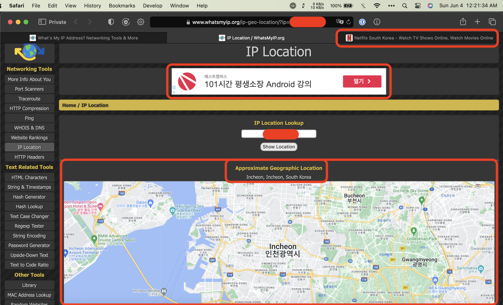
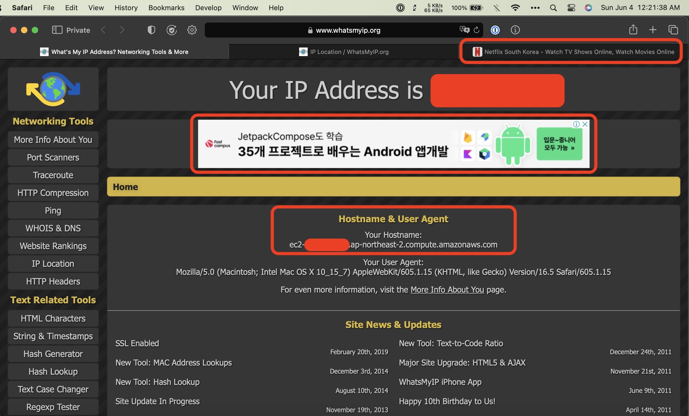

# Netflix Korea VPN

## Author: Keon Hee Park (Gunhee Park).

Gunhee Park is developing the Netflix Korea VPN application, a Node.js solution that enables macOS users in the USA to securely and privately access Netflix Korea content.

The source code development began on Saturday, June 3, 2023.
The project is still in progress toward completion.

## Description

This project delivers an optimized streaming experience by employing advanced software technologies, including AWS services, network security, VPN setup, software engineering, and region-specific deployment. In addition, it features a VPN server that runs a Node.js application for secure traffic management and uses Express.js for both server-side and client-side scripting.

## Technical Architecture Overview

The architecture includes several key components:

1. Client-side Application: A lightweight web interface built using HTML, CSS, and JavaScript to initiate connections with the OpenVPN server.
2. Express.js Server: Manages incoming HTTP requests from clients and maintains connections with the OpenVPN server hosted on AWS EC2 instances.
3. OpenVPN Server: Hosted on an AWS EC2 instance within a Virtual Private Cloud (VPC) to provide network isolation and secure VPN connections using industry-standard encryption protocols.
4. Amazon Web Services (AWS): Offers scalable infrastructure services required for this project, including the EC2 instances for hosting the OpenVPN server, VPCs for network isolation, Security Groups for managing network traffic, and Elastic IPs for consistent public IP addresses.

# Update on Progress: Sunday, June 4, 2023.

As of now, the Netflix Korea VPN project is progressing well and has successfully enabled access to Netflix South Korea content. Below are two screenshots demonstrating the proof of concept working.

## Screenshot 1: Geographic Location & Ad Banner



The first screenshot shows the approximate geographic location of Incheon, Incheon, South Korea based on my Amazon EC2 instance Public IP address as identified by www.whatsmyip.org. This indicates that our VPN server is functioning correctly and routing traffic through a South Korean IP address.

Additionally, an ad banner in Korean can be seen as further evidence that our connection is being recognized as originating from South Korea. The tab also displays the Netflix South Korea website, confirming successful access to region-specific content.

## Screenshot 2: Hostname & User Agent



The second screenshot shows the Hostname and User Agent information for my EC2 instance in the `ap-northeast-2` (Asia Pacific - Seoul) region. This confirms that our VPN server is running within this specific AWS region.

Similar to Screenshot 1, an ad banner in Korean can be seen as additional proof of concept working. The tab also displays the Netflix South Korea website, verifying successful access to region-specific content once again.

### How VPN Works

A Virtual Private Network (VPN) creates an encrypted tunnel between the user's device and a remote VPN server. When connected, all internet traffic from the user's device is routed through this secure tunnel, effectively masking their original IP address with one belonging to the VPN server. This process allows users to bypass regional restrictions imposed by content providers like Netflix and access content unavailable in their location.

## AWS Configuration

1. **Region**: The last used region for this project is `ap-northeast-2` (Asia Pacific - Seoul).
2. **Create an EC2 instance**: Launch a new Amazon EC2 instance named `Prod_EC2_VPN_Server_APNE2_SouthKorea` using the Amazon Linux 2023 AMI or any other preferred Linux distribution.
   - To create an instance with Amazon Linux 2023 AMI, select it from the available Amazon Machine Images (AMIs) list when launching a new instance in the AWS Management Console.
3. **Configure VPC**: Create a new Virtual Private Cloud (VPC) for your OpenVPN server, providing network isolation and security.
4. **Set up Security Groups**: Configure appropriate security groups for your EC2 instance, allowing only necessary traffic between the client and the OpenVPN server. For example:
   - Allow incoming SSH traffic (port 22) to manage the instance.
   - Allow incoming OpenVPN traffic (default port 1194) for establishing VPN connections.
   - Allow outgoing traffic to enable internet access while connected to the VPN.
5. **Assign Elastic IP**: Allocate an Elastic IP address and associate it with your EC2 instance, providing a static public IP address for connecting to the VPN server.
6. **SSH Access**: Use the provided key pair (`Prod_KeyPair_EC2_VPN_APNE2_SouthKorea.pem`) to SSH into your EC2 instance:
   ```
   ssh -i "Prod_KeyPair_EC2_VPN_APNE2_SouthKorea.pem" ec2-user@<Public_IP>
   ```

7. **IAM User and Policies**: Ensure that you have created an IAM user named `Prod_EC2_VPN_Admin_APNE2_SouthKorea` with appropriate permissions such as AmazonCloudWatchEvidentlyFullAccess, AmazonEC2FullAccess, AWSPriceListServiceFullAccess, and a custom AWSCostExplorerReadOnlyAccess policy.

   - To create a custom AWSCostExplorerReadOnlyAccess policy, use the following JSON policy document:

     ```json
     {
         "Version": "2012-10-17",
         "Statement": [
             {
                 "Effect": "Allow",
                 "Action": [
                     "ce:*"
                 ],
                 "Resource": [
                     "*"
                 ]
             }
         ]
     }
     ```

   - Attach this custom policy to your `Prod_EC2_VPN_Admin_APNE2_SouthKorea` IAM user.

8. **Install and configure OpenVPN Server**: Follow official OpenVPN documentation or use third-party scripts like [OpenVPN-install](https://github.com/Nyr/openvpn-install) to set up your OpenVPN server on the created EC2 instance.
9. **Download client configuration files**: After setting up your OpenVPN server, download generated client configuration files (.ovpn), which will be used later in this project's `src/server.js` file.

## Prerequisites

Before starting with the setup, ensure you have the following:

- Node.js (version 14 or above)
- An AWS account with the necessary permissions to create and manage resources
- An OpenVPN server installed and configured on your AWS EC2 instance

## Setup Instructions

1. Clone the repository:
   ```
   git clone https://github.com/parkkeonhee/NetflixKoreaVPN.git
   ```

2. Navigate to the project directory:
   ```
   cd NetflixKoreaVPN
   ```

3. Install required dependencies:
   ```
   npm install
   ```

4. In the `src/server.js` file, replace placeholder values with your actual OpenVPN credentials and EC2 instance details:
    ```javascript
    host: 'your-ec2-instance-public-ip',
    port: 'your-openvpn-server-port',
    username: 'your-vpn-username',
    password: 'your-vpn-password'
    ```

5. Start the Express.js server by using this command:`npm start`.
6. Access the client-side application by opening your web browser and navigating to `localhost:3000` (or your configured port).
7. Connect to VPN and start enjoying Netflix Korea content!

## Safety & Compliance

1. Ensure all communications are secure when dealing with VPNs and potentially sensitive user data.
2. Do not share .ovpn files or credentials.
3. Keep all systems updated with the latest security patches.
4. Check and comply with Netflix's terms of service when using this application.

## Troubleshooting

In case you encounter issues, follow these steps:

1. Check the AWS EC2 instance status and verify it's running.
2. Check OpenVPN server logs for errors or warnings.
3. Verify credentials in `src/server.js` match your OpenVPN credentials.

## License

This project is open source under an MIT license; feel free to use, modify, and distribute the code with attribution. For more detailed information, refer to the LICENSE file in the project repository.

## Future Work

1. Enhanced User Interface: Improve real-time connection status monitor, options to select available servers, and overall user experience.
2. Multi-User Support: Enable multiple simultaneous connections for different concurrent users.
3. Improved Security Measures: Implement OAuth or other robust authentication mechanisms for securely handling sensitive information like credentials.

## Contact

For inquiries, suggestions, or discussions:

- LinkedIn: Gunhee Park (https://linkedin.com/in/parkkeonhee)
- GitHub: parkkeonhee (https://github.com/parkkeonhee)
